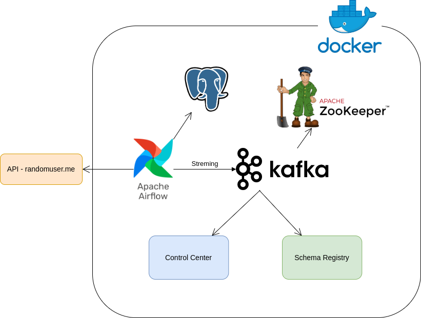

# Consumindo dados da api randomuser.me

## Arquitetura do pipeline

O pipeline é desenhado com os seguintes componentes:

- **Data Source**: Usamos a API `randomuser.me` para gerar dados aleatórios do usuário para nosso pipeline.
- **Apache Airflow**: Responsável por orquestrar o pipeline e armazenar os dados buscados em um banco de dados PostgreSQL.
- **Apache Kafka and Zookeeper**: Usado para transmitir dados do PostgreSQL para o mecanismo de processamento.
- **Control Center and Schema Registry**: Ajuda no monitoramento e gerenciamento de esquema de nossos streams Kafka.
